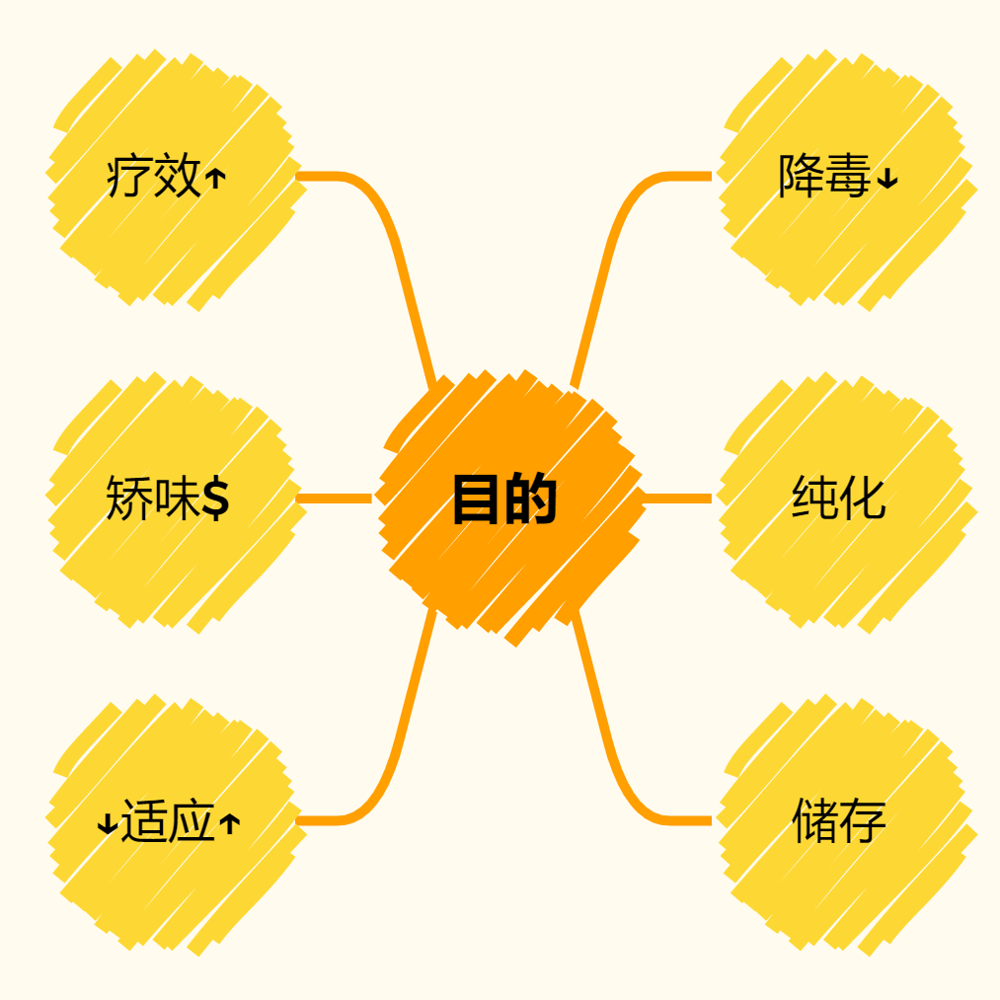

# 中药学笔记

按照临床医学综合能力（中医）之考研大纲分为掌握(★)、熟悉(●)、了解三类，与课内学业的要求95%重合。

**掌握**意为需要了解该药物的
- 药性
- 功效
- 主治病证
- **常用配伍**
- 用法用量
- 使用注意
- 相似功用鉴别点

**熟悉**意为需要了解该药物的
- 药性
- 功效
- 主治病证
- 用法用量
- 使用注意
- 相似功用鉴别要点

原则上“了解”药物不收录课内未曾讲解过的药物。

本文档中的编号不是最终编号
## Chapter0 临床中药学总论

### 0.0 学习方法基本概念

一、学习方法
1. 重视中药性能理论
2. 重视目录，按章节划分药物，例如：
    - 止血药 → 凉血止血药 → 小蓟
3. 学好章节概述，归纳章节药物的共同特点
4. **以功效为核心**联系性味、归经、应用
5. 重视药物的归纳分析和比较
    - 同章节类似的药物：如桑叶、菊花
    - 药物基源相关的植物：如生地、熟地
    - 不同章节主治相类似的药物：羌活、独活
6. 重视特殊记忆点：毒性、特殊用量、用法、使用注意
7. 学以致用、预习及复习，结合中医基础理论和中医诊断学，并在方剂学和临床课程后重新整理与看待整个体系。

二、基本概念
1. 中药：是指在**中医药理论**指导下认识和应用的药物。
    - 误区1：产地于中国 反例：乳香、没药、西洋参产于国外
    - 误区2：由中医使用 反例：西学中医师同样可以使用中药
    - 误区3：天然药物 反例：古代炼丹药物为非天然；麻黄碱提取物是西药
2. 草药：草药是中药的重要来源之一，中药体系中含有多种非草药。
    - 所谓“中草药”实为不规范的术语
3. 本草：现一般指**我国传统的药学，以及相关的药学著作**，相关研究学科为本草学。
    - 由于中药以植物药居多，古代亦可泛指中药
4. 中药学：专门研究中药基本理论和各种中药的品种来源、采制、性能、功效、临床应用、用法用量、使用注意等知识的一门学科。
    - 狭义的中药学为**临床中药学**，偏向于临床应用。

### 0.1 中药的起源和中药学的发展

主要掌握重点在于历代本草学的主要成就及代表作。

1. 秦汉时期
> 书名：《神农本草经》（简称“本经”）
> 
> 年代：东汉
>
> 作者：托名神农
>
> 内容：收载中药365味；首创三品分类法；总论序例记载中药学的理论
>
> 主要价值：
>
> 1. 是我国**现存**最早的药学专著
> 2. 初步奠定了药学理论*的基础（四气、五味、毒性、七情配伍、剂型）
> 3. 记载的药物大多朴实有验
>
> *注意：归经、升降浮沉理论成熟于金元时期，不在此列

2. 三国两晋南北朝时期
> 书名：《神农本草经》集注
>
> 年代：南北朝
>
> 作者：陶弘景
>
> 内容：总论回顾本草学发展；增补大量内容，尤其是鉴别；各论收载药物730种
>
> 特点：朱字为《本经》内容；黑字为《名医别录》内容；小字为自注
>
> 主要价值：
>
> 1. 各论**首次按药物自然属性分类**
> 2. **初步确立**了综合性本草的**合理**体例
>
> 注意：本书含有需加以否定的荒诞内容

3. 隋唐时期
> 书名：《新修本草》（唐本草，英公本草）
>
> 年代：唐朝
>
> 作者：以**苏敬**为主
>
> 领衔总定：长孙无忌 → 李勣
>
> 内容：载药844种（一说共850种），由**药图、图经、本草**三部分组成。（药图和图经已亡佚）
>
> 主要价值：
>
> 1. 我国历史上第一部**官修本草**
> 2. 采用图文对照，开创了药学编撰的新特色

4. 宋金元时期
> 书名：《经史证类备急本草》（简称“证类本草”）
>
> 年代：北宋
>
> 作者：唐慎微
>
> 内容：载药总数1558种（后人有增补），药后附列单方3000多首。
>
> 主要价值：
>
> 1. 具有重要的**文献价值**
> 2. 开创了大量附方的先例

5. 明朝时期
> 书名：《本草纲目》
>
> 年代：明朝
>
> 作者：李时珍
>
> 内容：载药1892种，内容按照**自然属性**分16部60类
>
> 主要价值：
>
> 1. 集我国16世纪以前本草学之大成
> 2. 被誉为**16世纪中国的百科全书**
> 3. 有现代植物分类法的萌芽，较西方早

其他明代本草（供研究生了解）
| 书名 | 《救荒本草》| 《滇南本草》| 《神农本草经疏》 | 《炮炙大法》 | 《本草蒙筌》 | 《白猿经》 |
| --- | ----------- | ---------- | -------------- | ----------- | ----------- | ---------- |
| 作者 | 朱橚 | 兰茂 | 缪希雍 | 缪希雍 | 陈嘉谟 | ??? |
| 价值 | 记载供灾荒时食用之物 | 记载云南地区习用药物400余种，是内容最丰富的古代地方性本草 | 阐述药理 | 专论炮制 | 百药煎，先于欧洲人制取没食子酸200余年 | 所记“射罔”，为乌头碱结晶，世界上所提取生物碱最早的记载 |

6. 清朝时期

（1）本草纲目的后续本草，更注重功效、临床、学术性
- 《本草备要》汪昂
- 《本草求真》黄宫绣
- 《本草从新》吴仪洛

（2）辑复《神农本草经》等古典文献

（3）补充《本草纲目》之不足
- 《本草纲目拾遗》赵学敏。载药921种，新增716种

### 0.2 中药的产地与采集

道地药材：**是指历史悠久，品种优良，炮制独特，疗效突出，带有明显地域特点的药材**。亦指某一地区（道）所产的某种药材，质量高、疗效好，因而素有盛名。

选用道地药材的意义：为了提高临床疗效，应尽可能根据产地选用药物，即尽可能选用道地药材。

中药产地与疗效的关系：产地的优选对于保证中药疗效起到至关重要的作用。

> 有名的道地药材（了解）
> 四川：川贝母、川芎、附子、黄连
>
> 东北：人参、五味子、细辛
>
> 河南：地黄、山药、牛膝
>
> 甘肃：当归
>
> 宁夏：枸杞
>
> 山西：党参
>
> 江苏：薄荷、苍术
>
> 山东：阿胶
>
> 云南：三七、茯苓
>
> 广东：广藿香、砂仁、陈皮

适时采集中药的目的：保证所含有效成分的质量

采集中药的方法
- 植物药材的采收，在有效成分含量最高时进行为好，除有效成分外，还要考虑三项指标
    - 有效成分含量
    - 有毒成分含量
    - 药材产量
- 动物类药材的采收，没有明显普遍规律
    - 鹿茸：过清明节，脱盘45-50d锯取头茬茸，过时则骨化为鹿角
    - 阿胶：冬至后剥取驴皮，皮厚质优
    - 桑螵蛸：3月中旬，过时则虫卵孵化，影响药材质量
- 矿物类药材成分稳定，大多随时可采

### 0.3 中药的炮制

中药炮制是指**按照中医药理论，根据药材自身性质，以及调剂、制剂和临床应用的需要，所采取的一项独特的制药技术。**

炮制的目的
 
（最好掌握一定的案例）
1. 降低或消除药物的毒副作用，保证用药安全
    - 附子、川乌、草乌、半夏、天南星、马钱子（降低毒性）
    - 巴豆、千金子（降低泻下作用，去油取霜）
    - 常山（减轻催吐副作用，用酒炒）
2. 增强药物的作用，提高临床疗效
    - 蜜炙百部、紫菀，能增强润肺止咳的作用
    - 酒炒川芎、丹参能够增强活血作用
    - 醋制延胡索、香附，能够增强止痛作用
    - 姜汁炙可加强止呕作用，如姜竹茹
3. 改变药物的性能或功效，使之更能适应病情的需要
4. 改变药物的某些性状，便于储存和制剂
5. 纯化药材，保证药材品质和用量准确
6. 矫臭、矫味，便于服用

炮制的方法

主要掌握辅料炒：辅料炒是在炒的时候不但要加入药物，而且要加另外的一些原料，药物和固体辅料拌称辅料炒
- 辅料有砂、土、米、麸、蛤粉及滑石粉等
- 目的：增强疗效、减少刺激，减轻毒性，矫臭矫味，便于制剂

炙法：药物用液体辅料拌炒的炮制方法
- 常见辅料：黄酒、炼蜜、米醋、盐水、姜汁、甘草汁
- 目的：改变药性，增强疗效，降低毒副作用

水飞：将不溶于水的矿物或贝壳置于水中，反复研磨而制取极细粉末的加工方法
- 目的
  - 制取极细粉末
  - 除去可溶性有害物质
  - 防止加工时药粉飞扬

### 0.4 中药性能理论

（待补充）

### 0.5 中药的作用与功效

（待补充）
### 0.6 中药的应用

（待补充）

## Chapter1 解表药 

### 1.1 发散风寒药
> 主辛温，发散风寒，治疗风寒表证

1 ★麻黄 辛温，发汗解表（生用），宣肺平喘（蜜炙/捣绒），利水消肿

2 ★桂枝 甘温，发汗解肌，温通经脉，助阳化气，平冲降逆

3 ★苏叶 解表散寒，行气和胃，解鱼蟹毒

4 ★生姜 （呕家圣药）解表散寒，温中止呕，温肺止咳，解鱼蟹毒，增进食欲促消化

5 ★香薷 （夏月麻黄）发汗解表，化湿和中，利水消肿

6 ★荆芥 祛风解表，透疹消疮，止血（荆芥炭）

7 ★防风 （风药润剂）祛风解表，祛风胜湿止痛，祛风止痉，祛风止痒

8 ★羌活 散寒解毒，祛风胜湿止痛，治疗外感风寒夹湿，风湿有关内神经麻痹

9 ★白芷 解表散寒（很温和），祛风疼痛，宣通鼻窍，燥湿止带，消肿排脓，祛风止痒

10 ★细辛 解表散寒，重在散，解表力弱；祛风止痛，温肺化饮（小青龙汤）通鼻、心窍

11 ●藁本 解表散寒 祛风湿止痛（善达头巅顶）

12 ★苍耳子 发散风寒，通鼻窍，祛风湿止痛止痒，为治疗鼻渊之要药

13 ●辛夷 发散风寒，通鼻窍（治疗鼻渊）

●葱白 发汗解表，散寒通阳，解毒散结，通经下乳

## 1.2 发散风热药（发散风热，治疗风热表证，温病卫分证）

14 ★薄荷 治疗风热感冒，风温初起，可清利头目，利咽消肿，透疹，祛风止痒

15 ★牛蒡子 疏散风热利咽，清热肌表散肿，透疹，祛风止痒，宣肺祛痰

16 ★蝉蜕 疏散风热，利咽开音，透疹明目退翳，息风止痉

17 ★桑叶 疏散风热，平抑肝阳，清肝明目（疏散作用强，清肺润燥，凉血止血）

18 ★菊花 疏散风热，平抑肝阳，清肝明目（平肝，清肝明目作用较桑叶强，清热解毒）

19 ★蔓荆子 疏散风热，清利头目

20 ★柴胡 解表退热，升举阳气，主入少阳，疏肝解郁，升阳多用于中气下陷（非典型，退热）

21 ★葛根 解表退热，升举阳气，主入脾胃，善治项背强痛，生津止渴，透疹。升阳多用于脾虚泄泻，为治泄泻良药，又可用于热泻热痢的治疗，通经活络，解酒毒（葛花解酒醒脾）。

22 ★升麻 解表退热，升举阳气，透疹，清热解毒力强，尤善解阳明热毒，可用于热毒所致咽喉肿痛，牙龈肿痛。常与柴胡同用（非典型解表药）

23 ●淡豆豉 平和解表，宣发郁热除烦

●浮萍 宣散风热，透疹，利尿

## Chapter2 清热药

### 2.1 清热泻火药（清泄气分、脏腑实热）

24 ★石膏 清热泻火，除烦止渴 重在清解，锻用具收湿敛疮，生肌止血之功

25 ★知母 清热泻火，除烦止渴 偏于清润，清肺胃实热，又退虚热，可滋阴润燥

26 ★芦根 清热泻火，生津止渴，清肺热排脓，清胃止呕，清热利弱

27 ★天花粉 清热泻火，生津止渴，清肺热润肺燥，消肿排脓，内热消渴多用

28 ●淡竹叶 清热泻火，除烦止湿，利弱通淋（导赤散加减用）

29 ★栀子 泻火除烦，治疗气分热盛，烦躁不安，可通泻三焦之火，清热利湿，凉血止血

30 ★夏枯草 清肝？明目，散结消肿（痰火郁结所致）

31 ★决明子 清肝明目，润肠通便

## 2.2 清热燥湿药（清热燥湿，清热泻火）
32 ★黄芩 清热燥湿，清热泻火，清热解毒 清中上焦湿热，湿温暑湿 清气分热肺火少阳热

33 ★黄连 清热燥湿，清热泻火，清热解毒 清中焦湿热 治胃肠湿热 清心火 胃火

34 ★黄柏 清热燥湿，清热泻火，清热解毒 清下焦湿热 退虚热 泻相火 除骨蒸 潮热盗汗

35 ★龙胆 清热燥湿，泻肝胆火

36 ★苦参 清热燥湿利弱，杀虫止痒，清热解毒（用得少）

37 ●秦皮 清热燥湿解毒，清肝明目，清肺止咳平喘，止痢，收涩。

38 ★白鲜皮 清热燥湿解毒 

## 2.3 清热解毒药（清热解毒）

39 ★金银花 清热解毒，疏散风热 清宣疏散强，凉血止痢，清热解暑

40 ★连翘 清热解毒，疏散风热 清降之性强，疏散之力不如金银花，长于清心火，清心解毒，疮家圣药，亦治瘰疬痰核

41 ●穿心莲 清热解毒消肿，清热燥湿，清肺凉血

42 ★大青叶 清热解毒，凉血消斑

43 ★板蓝根 清热解毒，凉血利咽（临床多用于抗病毒）

44 ★青黛 清热解毒，凉血，清肝泻火定惊

45 ★贯众 清热解毒，凉血止血，杀虫（用得少）

46 ★蒲公英 清热解毒，清利湿热，利尿通淋，清肝明目

47 ★紫花地丁 清热解毒，凉血消肿【资料或许有谬误，原为“黄花地丁”，待确认】

48 ●野菊花 清热解毒，泻火平肝

49 ★土茯苓 清热解毒，通利关节，清利湿热，可治疗痛风，忌茶

50 ★鱼腥草 清热解毒，清痈排脓（治肺痈良药），利尿通淋，清热利湿止痈（湿热淋证良药）

51 ●大血藤 清解消痈，活血祛瘀止痛，活瘀强，肠痈初起，热毒瘀滞，腹痛涨满，祛风通络

52 ●败酱草 清解消痈，活血祛瘀止痛，清解强，排脓，脓成或未皆可用，对肠痈已成尤可

53 ★射干 清热解毒利咽，消多痰（寒热均用），尤以热毒痰火郁结者为宜

54 ★山豆根 清热解毒利咽，清热解毒消肿强，清胃火，大苦大寒用量小

55 ●马勃 清热解毒利咽

56 ★白头翁 清热解毒，凉血止痢，清热燥湿（临床上没有优势）

57 ●马齿苋 清热解毒，凉血止痈

58 ●鸦胆子 清热解毒，截疟止痢

59 ●白花蛇舌草 临床常用于肿瘤治疗

60 ★熊胆粉 清热解毒，清肝明目，息风止痉

61 ★重楼 清热解毒，消肿止痛，凉肝定惊

### 2.4 清热凉血药（清解营血分热）

62 ★生地 清热凉血止血，养阴生津（营热 血热 血热出血 阴虚津亏证）

63 ★玄参 清热凉血，滋阴降火，泻火解毒，利咽散结（治疗白喉首选药）

64 ★牡丹皮 清热凉血，活血化瘀止痛，清热凉血强，退虚热。配伍止血药

65 ★赤芍 清热凉血，活血化瘀止痛，活血化瘀止痛强，能清肝热。配伍止血药

66 ●紫草 清热凉血，活血解毒，透疹消斑

67 ★犀角/水牛角 清热凉血，解毒定惊

### 2.5 清虚热药（清虚热，退骨蒸）

68 ★青蒿 清透虚热，凉血除蒸，解暑，截疟

69 ★地骨皮 凉血退蒸，清肺降火，善治有汗骨蒸，可治疗内热消渴

70 ●银柴胡 清虚热，除疳热

71 ●胡黄连 退虚热，除疳热，清湿热

## Chapter3 泻下药（泻下通便，排除积滞，逐水消肿，清热泻火）

### 3.1 攻下药 
73 ★大黄 泻下攻积，泻火解毒，逐瘀通经，利湿退黄

74 ★芒硝 泻下攻积，清热，润燥软坚，善除燥矢内结

75 ●番泻叶 清热泻下，导滞利水

76 ●芦荟 泻下通便，清肝杀虫

### 3.2 润下药（润滑大肠，治疗肠燥便秘为主）

77 ★火麻仁 润肠通便 兼能滋养补虚，适体弱，通便强。

78 ●郁李仁 润肠通便 行大肠气滞，兼下气行水，不补虚。

### 3.3 峻下逐水药（排除体内水湿，治疗形证具实病证为主）

79 ★甘遂 泄水逐饮，消肿散结

80 ★京大戟 泄水逐饮，消肿散结

81 ★芫花 泄水逐饮，消肿散结

## Chapter4 祛风湿药

### 4.1 祛风寒湿药（祛风湿 通经络 散寒止痛）

72+ ★独活 治疗少阴头痛，温和解表，祛风止痒

83 ★威灵仙 最擅风痹，消骨鲠

84 ●川乌 祛风湿，温经止痛

85 ★蕲蛇 辛温走窜，透骨搜风，长于通经络，止痉止痒

●乌梢蛇

86 ★木瓜 舒筋活络，治疗关节屈伸不利，和胃化湿

### 4.2 祛风湿热药（祛风湿 通经络 清热止痛消肿）

87 ★秦艽 风家润药，治中风半身不遂，退虚热，治湿热黄疸

88 ★防己 祛风湿止痛，利水消肿，治下焦湿热

89 桑枝 祛风湿，利关节，行水气

90 ●豨签草 祛风湿，舒筋活络

91 ●臭梧桐叶 祛风湿，利关节

92 ●络石藤 祛风通络，凉血消肿

93 ●雷公藤 治疗风湿顽痹，活血消肿止痛，杀虫解毒

### 4.3 祛风湿强筋骨药（祛风湿，补肝肾，强筋骨）

94 ★五加皮 共，利水消肿

95 ★桑寄生 共，安胎

96 ●狗脊 祛风湿，补肝肾，强腰膝，善祛脊背风湿

## Chapter5 化湿药

98 ★广藿香 化湿止呕，发表解暑（暑多夹湿） 生姜治胃寒呕吐，藿香治湿浊中阻之呕吐

99 ★佩兰 平，醒脾开胃，发表解暑

100 ★苍术 燥湿健脾（健脾白术好）祛风湿，解表，明目

101 ★厚朴 燥湿行气导滞，下气消痰平喘

102 ★砂仁 更为温燥，温中化湿行气作用更强

103 ★白豆蔻 重在温胃善止呕

## Chapter6 利水渗湿药

### 6.1 利水消肿药（利水渗湿，治疗水肿溺不利）

104 ★茯苓 利水渗湿要药 痰饮必用茯苓，弱健脾

105 ★薏苡仁 利水渗湿，健脾止泻，除痹舒筋，清热排脓

106 ★猪苓 治水肿，溺不利，利水渗湿强于茯苓

107 ★泽泻 利水渗湿，泻热，治疗热淋带下

108 ●香加皮 利尿消肿，祛风湿强筋骨（？）

### 6.2 利尿通淋药（利水渗湿，清热利尿通淋）

109 ★车前子 共，清肺化痰，渗湿止泻，清肝明目

110 ★滑石散 滑能利窍 共，清热解暑，收湿敛疮

111 ★木通 共，清心除烦，清热通经下乳

112 ★瞿麦 共，活血通经

113 ●萹蒿 共，杀虫止痒

114 ●地肤子 共，祛风止痒，清热利湿

115 ●海金沙 清热利湿，通淋止痛（善止尿道疼痛，治疗诸淋痛）

116 ★石韦 利尿通淋，清肺止咳，凉血止血（治溺血）

117 ★萆薢 利湿去浊，祛风除痹，通络止痛（现代临床治疗痛风病）

利湿退黄药（清利湿热，利胆退黄）

118 ★茵陈 共，治疗黄疸的要药，阴黄配栀·黄·柏、阳黄配姜附。（另疗暑湿、湿温、湿疮疹）

119 ★金钱草 利湿退黄，利尿通淋，解毒消肿

120 ★虎杖 利湿退黄，清热解毒，散瘀止痛，化痰止咳，泻热通便。

## Chapter7 温里药（温散里寒）

121 ★附子 回阳救逆，补火助阳，散寒止痛

122 ★干姜 温中散寒，回阳通脉，温肺化饮

123 ★肉桂 补火助阳，引火归原，散寒止痛，温通经脉

124 ★吴茱萸 散寒止痛→寒凝肝脉；降逆止呕；助阳止泻→五更泄泻，脾虚久泄，寒湿泄泻

125 ●小茴香 散寒止痛，理气和中

125 ★丁香 温中降逆 散寒止痛 温肾助阴（一般不作补肾药）

127 ★高良姜 温中止呕

128 ★花椒 杀虫止痒 （上二者，温中散寒止痛，用量宜小）

## Chapter8 理气药
寒证他，热证川楝子。

129 ★陈皮 理气健脾，燥湿  --（温）化痰

130 ★青皮 疏肝破气（醋炙，疏肝止痛作用+），消食积化滞

131 ★枳实 破气，破气消积；化痰除痞（尚可用来治疗脾胃气陷胃下垂）

132 ●佛手 平和，疏肝理气

133 ●香橼 和胃止痛，燥湿化痰

134 ★木香 行【脾胃】气止痛，健脾【治脾虚】消食

135 ★沉香 行气止痛，温中降逆止呕（不补虚）

136 ★乌药 行气散寒止痛，温肾散寒（不补虚）

137 槟榔衣 行气宽中，利水消肿

138 ★川楝子 疏肝泻热，行气止痛，杀虫

139 荔枝衣 行气散结，散寒止痛

140 ★香附 平，疏肝解郁，理气宽中，调经止痛（气病之总司，女科之主帅，寒热虚实皆用）

141 ★薤白 （治疗胸痹心痛要药）行气通阳，行气导滞

97+ ●柿蒂（止呃要药，呕吐一般不用）降气止呃

## Chapter9 消食药

9A ★山楂 消食化积，止泻止痢，行气散瘀，降脂化浊

9B ●六神曲 消食和胃

9C ●稻芽 消食健胃，回乳消涨

9D ★莱菔子 消食除胀，降气化痰

9E ★鸡内金 消食健胃，固精止遗，通淋化石

## Chapter10 驱虫药

10A ★使君子 杀虫消积

10B ★苦楝皮 杀虫，疗癣

10C ★槟榔 杀虫消积，行气利水，截疟；焦槟榔：消食导滞

10D ●鹤草芽● 杀虫

10E ★雷丸  杀虫消积

10F ●榧子 杀虫消积，润燥通便，润肺止咳

10G ●南瓜子 杀虫

## Chapter11 止血药

### 11.1 凉血止血药（苦寒甘寒，治疗血热出血）

143 ★小蓟 共，散瘀解毒消痈（兼能利溺通淋；治疗溺血、血淋）

144 ★大蓟 共，散结消痈（↑相比，作用广，力强）（吐血、咯血、崩漏下血）

145 ★地榆 （治疗烫伤、湿热疮疹之要药）凉血止血，尤擅下焦；解毒敛疮

146 ★槐花（常与地榆配伍）凉血止血，尤擅痔便；清肝泻火

147 ●侧柏叶 凉血止血，化痰止咳，生发乌发

148 ★白茅根 （可大量长用）凉血止血（不强）；清热利弱

149 ★苎麻根 （止血安胎要药）清热解毒，兼能利溺通淋

### 11.2 止血化瘀药（多具辛，治疗瘀阻出血）

150 ★三七 （伤科要药，止血而不留瘀，化瘀而不伤正）化瘀止血，消肿定痛

151 ★茜草 凉血祛瘀（最适血热夹瘀）；活血通经（二重 络·月）

152 ★蒲黄 化瘀止血（常用于崩漏、产后血瘀腹痛），利溺通淋（生品化瘀，炒用止血）

收敛止血药（用于出血，且无明显邪气）

153 ★白及 收敛止血（收敛止血要药，现外伤出血止血，为三七所取代），外用消肿生肌

154 ★仙鹤草 收敛止血；止痢；补虚→脱力劳伤；截疟

155 ●棕榈炭 收敛止血，治崩漏，收敛过强易留瘀

156 ●血余炭 收敛止血，兼化瘀

### 11.3 温经止血药

157 ★艾叶 温经止血，散寒止痛调经，安胎，祛（下焦）湿止痒

158 ●炮姜 温经止血，温中止痛（善治中焦虚寒）

159 ●灶心土 （温经止血要药）温中止血，止呕止泻

## Chapter12 活血化瘀药（多偏温而能凉血，伍行气药）

### 12.1 活血止痛药（主兼行气）

160 ★川芎 （治头风痛要药）活血行气，祛风止痛。血中气药，兼能燥湿

161 ★延胡索（止痛良药）活血行气止痛，非典型活血化瘀药，主要镇痛。

162 ★郁金【寒】 活血止痛，行气解郁，凉血清心降气，利胆退（阳）黄

163 ★姜黄 破血行气，通经络止痛，活血行气姜黄更甚，行气解郁不如郁金。

164 ★乳香 活血行气止痛，消肿生肌（行气略强）

165 ★没药 活血行气止痛，消肿生肌（活血略强）

166 ★五灵脂 （活血止痛要药）炒用化瘀止血，止血而不留瘀（上一个是三七）

醋炙，化瘀止血之力增强，酒炙，活血止痛之力增强。

### 12.2 活血调经药（主兼凉血）

167 ★丹参 活血调经止痛，凉血消痈，清心除烦

168 ★红花 （调经要药）活血通经，祛瘀止痛（活血化瘀作用强，治血瘀常用）

169 ★桃仁 平，活血祛瘀，润肠通便，止咳平喘。炒用偏润燥，生用偏活瘀

170 ★益母草 （妇科经产要药）活血调经，利尿消肿，清热解毒。

171 ★牛膝（怀牛膝为正）逐瘀痛经，补肝肾，强筋骨，利尿通淋，引火下行（治疗上部火热）

172 ★鸡血藤 行血补血，调经止痛，舒筋活络

### 12.3 活血疗伤药（主兼止血）

173 ★土鳖虫 破血逐瘀，续筋接骨

142+ ★马钱子 散结消肿，通络止痛

174 ●骨碎补 活血疗伤止痛，补肾强筋骨，消风祛斑，治疗白癜风、斑秃

### 12.4 破血消癥药（破血逐瘀，消癥散积，活血作用最强）

175 ★莪术 破血行气，消积止痛，可治疗食积重症

176 ★三棱（常与莪术相须）莪术行气强，食积多用，三棱破血强。

177 穿山甲 活血消癥通经，下乳，消肿排脓

## Chapter13 化痰药（配伍：行气药，治痰不治气，非其治也）

### 13.1 温化寒痰药

178 ★半夏 （止呕圣药）燥湿化痰湿痰风，降逆止呕，消痞散结，消肿止痛

179 ★天南星 燥湿化痰，祛风化痰解痉，消肿止痛（外用）

180 ★白附子 上行头面，化痰祛风，止痉止痛，散结解毒

181 ★芥子 温化寒痰-利气，通络止痛-散结（痰在胁下皮里膜外，非白芥子不能达，其善除胸胁骨节间痰）

182 ●皂荚 祛顽痰，通窍开闭，散结消肿，杀虫止痒，通便

183 ★旋覆 降气止呕，止咳化痰行水（诸花皆升，旋覆独降）

184 ★白前 长于祛痰，肺家要药（温而不燥）

### 13.2 清化热痰药

185 贝母 苦寒归肺，清热化痰，散结消痈 

★川贝润甘。

★浙贝苦寒甚，偏清泄，较宜于外感风热，痰热郁肺之咳嗽，消痈散结优于川贝。

186 ★瓜蒌 清热化痰，消痈散结，理气宽胸

187 ★竹茹 清热化痰

●竹沥，●天竺黄 清热止呕除烦，豁痰定惊利窍，清心定惊

188 ●前胡（白前相须）降气化痰，疏散风热

189 ★桔梗 宣肺祛痰、利咽、排脓（引药上行，有舟辑之力）

190 ●海藻 咸寒，消痰软坚散结，利水消肿，治疗无形之痰，反甘草。

191 ●昆布 咸寒，消痰软坚散结，利水消肿，治疗无形之痰

192 ●黄药子 化痰散结消瘿，清热解毒，凉血止血

193 ●礞石 坠痰下气，治疗顽痰，平肝镇惊

## Chapter14 止咳平喘药（止咳，平喘，或皆具也）

194 ★苦杏仁（治疗咳喘之要药）止咳平喘，润肠通便

195 ★紫苏子 降气化痰，止咳平喘，润肠通便（治疗咳嗽痰多）

196 ★百部 润肺止咳，单行杀虫灭虱

197 ★紫菀 温而不燥，润肺化痰止咳，化痰作用强

198 ★款冬花 温而不燥，润肺化痰止咳，止咳作用强（30g以上可通便）

199 ●马兜铃 清肺降气，止咳平喘，清肠消痔

200 ●枇杷叶 清肺化痰，止咳平喘，降逆止呕

201 ★桑白皮 泻肺热，兼泻水气，肺热喘咳

202 ★葶苈子 利水消肿，泻肺平喘，力强，邪盛多用 

203 ★白果 敛肺化痰定喘止带，治疗肺肾两虚之虚喘

204 ●洋金花 平喘止咳，镇痛止痉

## Chapter15 安神药

205 ★朱砂 镇心安神，清热解毒

206 ★磁石 镇惊安神，平肝潜阳

207 ★龙骨 （见217）

208 ★琥珀 镇静安神，活血化瘀，利弱通淋

209 ★酸枣仁 养心益肝，安神敛汗

210 ★柏子仁 养心安神，止汗，润肠

211 ★远志 安神益智，交通心肾，祛痰消肿

212 ●合欢皮 解郁安神

213 ●首乌藤 养血安神，祛风通络

## Chapter16 平肝息风药

### 16.1 平抑肝阳药（平抑肝阳，肝阳上亢，本虚肝肾阴，阳亢为标实）

214 ★石决明 （眼科要药）平肝潜阳，清肝明目，且补肝阴

215 ●珍珠母 平肝潜阳，清肝明目，定惊安神

216 ★牡蛎 潜阳补阳，镇心安神，软坚散结，收敛固涩

217 龙骨 （相比于龙骨，入心经，长于镇心安神，收敛固涩之功效强于牡蛎）【？？？】

218 ★赭石 平抑肝阳，清降肝火，重镇降逆，凉血止血

219 ●刺蒺藜 平肝解郁，活血祛风，明目止痒

230 ●罗布麻叶 平肝安神，清热利弱。临床上用于治疗高血压

### 16.2 息风止痉药（息风止痉，治疗热极生风，阴虚生风，诸风之证）

231 ★羚羊角 息风止痉，平肝潜阳，清肝明目，凉血解毒

232 ★牛黄 息风止痉，化痰开窍（治疗热闭神昏），清热解毒

233 ★钩藤 息风止痉，清热平肝

234 ★天麻 息风止痉（治疗诸病因之肝风内动）平抑肝阳，祛风通络止痛

235 ★地龙 清热定痉，通络平喘（治疗高热惊厥抽搐，中风偏瘫，热痹）

236 ★全蝎 息风止痉，攻毒散结，通络止痛

237 ★蜈蚣 息风止痉，攻毒散结，通络止痛（全面强于全蝎，但毒烈）

238 ★僵蚕（似天麻）息风止痉，兼化痰，祛风止痒，通络止痛，化痰散结，治肺热痰多

## Chapter17 开窍药（开窍醒神，治疗神志昏迷之实证）

239 ★麝香 开窍醒神，活血通经止痛（开窍通痹之功最强）

240 ●冰片 （凉开药）开窍醒神，清热止痛（外科要药，透皮给药吸收剂）

241 ●苏合香 其辛香气烈（开窍力弱，治疗痰湿蒙蔽清窍神昏），开窍醒神，辟秽，散寒止痛

242 ★石菖蒲 豁痰开窍，化湿和胃，安神益智（此似远志）

## Chapter18 补虚药

### 18.1 补气药

243 ★人参 大补元气，补益脏气，生津止渴，安神增智，扶正祛邪

244 ★西洋参 补益元气，补气养阴，清热生津

245 ★党参 补气，生津，补血（不补心肾之气，不大补元气，不益智安神）

246 ★太子参 补气养阴，作用缓和

247 ★黄芪（亦疮家圣药）补脾肺之气，生血，托毒生肌，活血化瘀而行滞

248 ★白术 补气健脾，若无湿滞，治疗脾气虚不如人参；止汗安胎

249 ★山药 气阴双补，肺脾肾兼治，补气养阴

250 ●白扁豆 补脾和中，化湿消暑

251 ★甘草 （国老之药）补心脾气，祛痰止咳平喘，缓急止痛，清热解毒，蜜炙转微温

252 ●大枣 补气健脾，养血安神（气血双补之品）

（所有补气药都补脾气，除白术、甘草、大枣外都补肺气，人参、西洋参、甘草补心气，人参西洋参山药补肾气）

### 18.2 补阳药
253 ★鹿茸 壮元阳，益精血，强筋骨，调冲任，托疮毒

254 ★紫河车 补肾益精，养血益气

255 ★肉苁蓉 补肾阳，益精血，润肠通便

256 ★淫羊藿 补肾壮阳，祛风湿，强筋骨

257 ★巴戟天 与淫羊藿类似，相对淫羊藿而言，温而不燥，但还是偏温燥，弱益精血作用

258 ★杜仲 补肝肾，强筋骨，安胎，补肾较续断强

259 ★续断 补肝肾，强筋骨，安胎，治疗骨折，并有一定行血作用

260 ★补骨脂 补肾暖脾止泻，固精缩弱，偏于温补肾阳，五更泻主药。还可纳气平喘

261 ●益智仁 补肾暖脾止泻，固精缩弱，长于温脾摄唾。

262 ★菟丝子 作用平和，补肾固精缩弱，养肝明目；可补脾止泻，安胎止漏；长于明目。

263 ●沙苑子 作用平和，补肾固精缩弱，养肝明目；偏于固涩，平补肝肾。

264 ★蛤蚧 补肺益肾，纳气平喘，助阳益精，治虚劳嗽喘要药

265 ●核桃仁 补肾温肺，润肠通便

266 ★冬虫夏草 补肾助阳，补肾益肺，止血化痰，止咳平喘
### 18.3 补血药

267 ★当归 补血活血，调经止痛，消肿生肌，润肠通便

268 ★熟地 补血滋阴，益精填髓（治疗血虚要药，补肾阴最强）有强心作用

269 ★白芍 养血调经，敛阴止汗，柔肝止痛，平抑肝阳（桂枝调卫，白芍调营）

270 ★阿胶 补血止血，滋阴润肺（补虚作用十分强大）

271 ★何首乌 补肝肾，益精血，截疟解毒，润肠通便，化浊降脂，乌须发

### 18.4 补阴药

272 ★北沙参 养肺胃之阴，又清肺胃之热；清养肺胃优，肺胃阴虚有热多用。

273 ★南沙参 养肺胃之阴，又清肺胃之热；兼有益气祛痰作用，较宜气阴两伤燥痰咳嗽

274 ★百合 养阴润肺，兼能止咳，清心安神。

275 ★玉竹 养阴润肺，长于生津止渴，常用于热病津伤口渴消渴，养阴不滋腻恋邪。

276 ★黄精 养阴润肺，益肾精，补肾气，用于肺气阴两伤，还能补气健脾。

277 ★麦冬 养阴润肺，益胃生津；兼入心经，养心阴，清心除烦。

278 ★天冬 养阴润肺，益胃生津；兼入肾精，滋肾阴，降虚火。

279 ★石斛 益胃生津，滋阴清热，补肾养肝

280 ★枸杞子 滋补肝肾，益精明目，肾虚消渴疗效好

290 ★墨旱莲 补肝益肾，退虚热，凉血止血，用于血热或阴虚血热之出血

291 ★女贞子 补肝益肾，退虚热，补肝阴作用强，明目。

292 ★龟甲 滋阴潜阳，退虚热；滋阴强，益肾健骨，养血补心，固经止血。

293 ★鳖甲 滋阴潜阳，退虚热；清虚热强，软坚散结。

## Chapter19 收涩药（须配伍补虚药）

### 19.1 固表止汗药（治自汗盗汗）

294 ●麻黄根 强敛止汗

295 浮小麦 益气固表止汗，养阴除热（治疗心气虚自汗，阴虚内热盗汗）

### 19.2 敛肺涩肠药（止咳喘、止泻）

296 ★五味子 除无止血，他收敛兼具（汗喘泻精弱带）历来为滋补强壮药

297 ★乌梅 收敛固涩（咳泻血），安蛔止痛，生津止咳

298 ●五倍子 专一固涩，不补虚，可用于肺热咳喘，外用收敛止血

299 ★诃子（诃黎勒） 敛肠止泻，敛肺止咳，利咽开音，止血

300 ★肉豆蔻 涩肠泻，温中行气

301 ★赤石脂 涩肠止泻，收敛止血带，敛疮生肌，治疮痈久溃不敛

302 ●禹余粮 涩肠止泻，收敛止血带

### 19.3 固精缩溺止带药

303 ★山茱萸 补益肝肾（平补肝肾要药），收敛固脱（止血涩精缩溺敛汗）

304 ★覆盆子 补益肝肾明目，益肾固精缩弱

305 ★桑螵蛸 补肾助阳，固精缩弱 （补而能涩，以缩弱见长）

306 ★金樱子 固精缩弱，固崩止带，涩肠止泻（不补专固涩）

307 ★海螵蛸 固精止带，收敛止血，制酸止痛，收湿敛疮

308 ★莲子 益肾固精，补脾止泻，止带，养心安神

309 ★芡实 益肾固精，补脾止泻，除湿止带，有收敛、滋养作用

310 刺猬皮 固精缩溺，收敛止血，化瘀止痛

311 ★椿皮 清热燥湿，收敛止带

312 鸡冠花 收敛止血，止带止痢

## Chapter20 涌吐药

313 ★常山 涌吐痰涎，截疟   治疗痰饮停聚，胸膈痞塞

314 藜芦 涌吐风痰，杀虫疗疮  治疗中风、癫痫、喉痹及疥癣秃疮

315 ●瓜蒂 涌吐，祛湿热   主治热痰、宿食、湿热黄疸

316 ●胆矾 涌吐，解毒化湿，蚀疮祛腐 主治风痰壅盛，误食毒物，疮腐肿毒等 

## Chapter21 攻毒杀虫止痒药

## Chapter22 拔毒化腐生肌药
